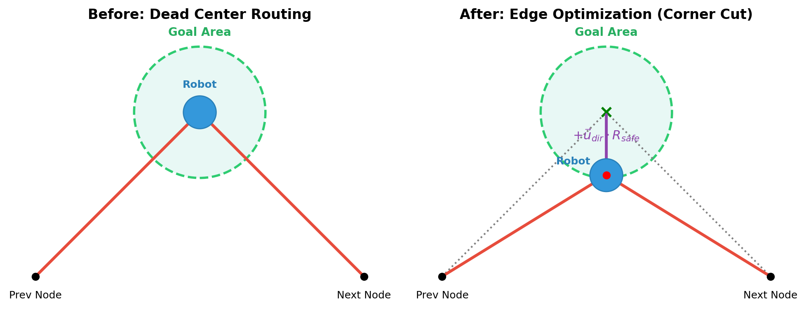
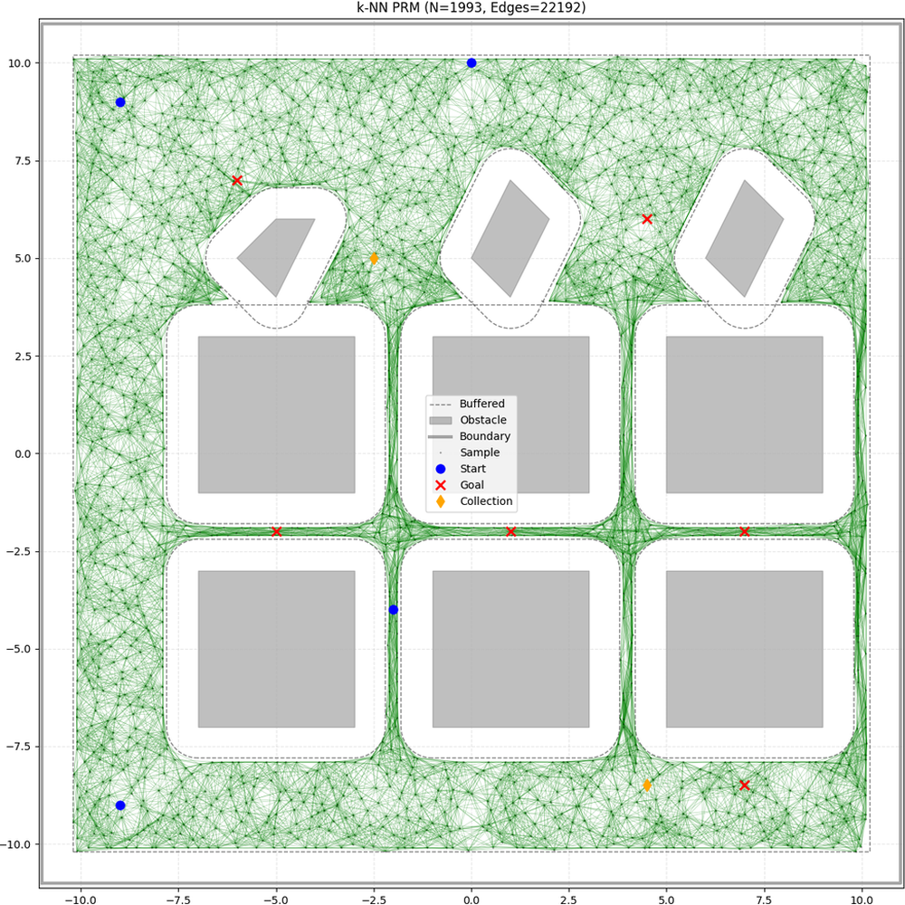
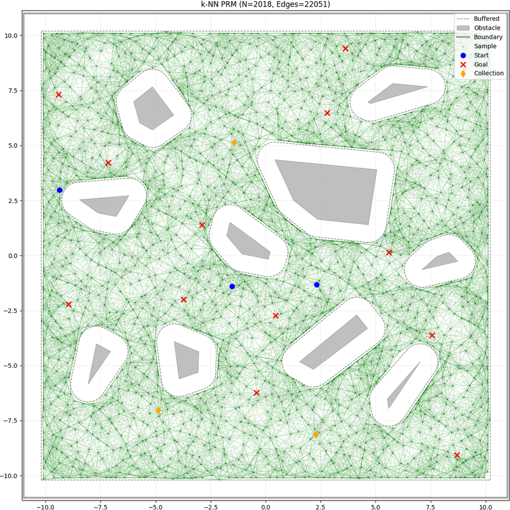
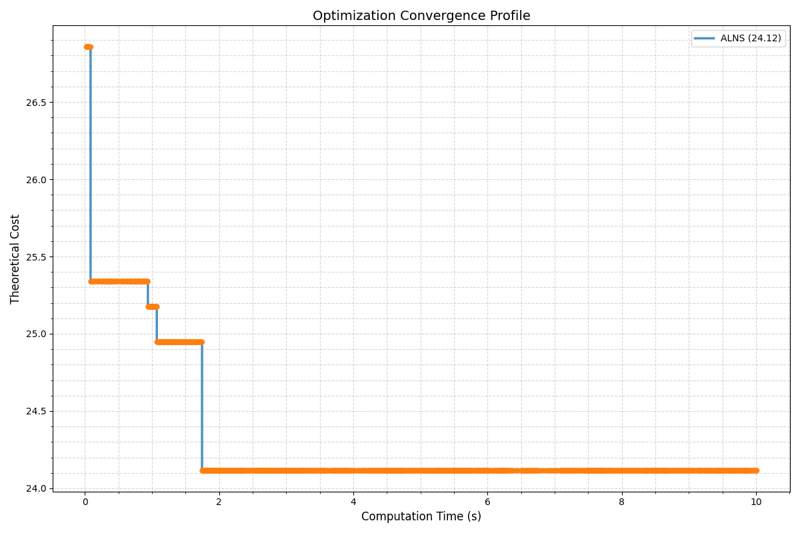
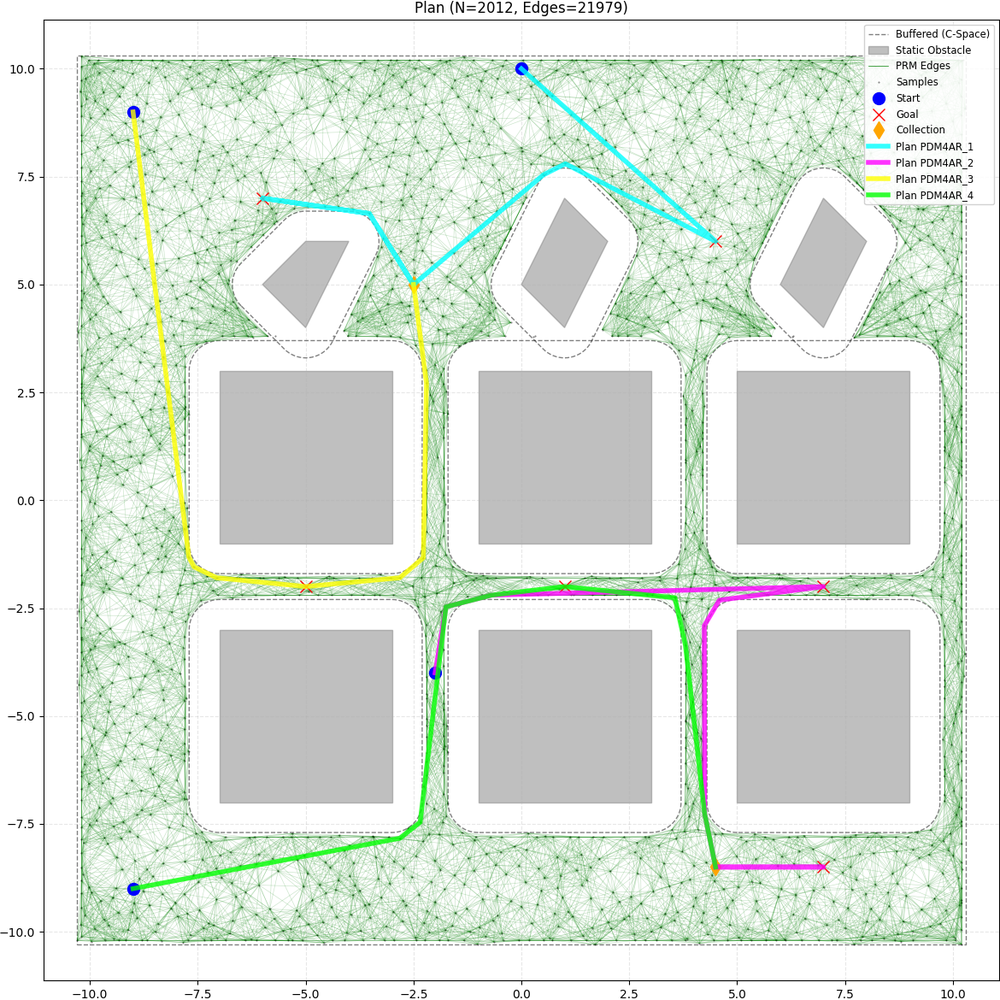
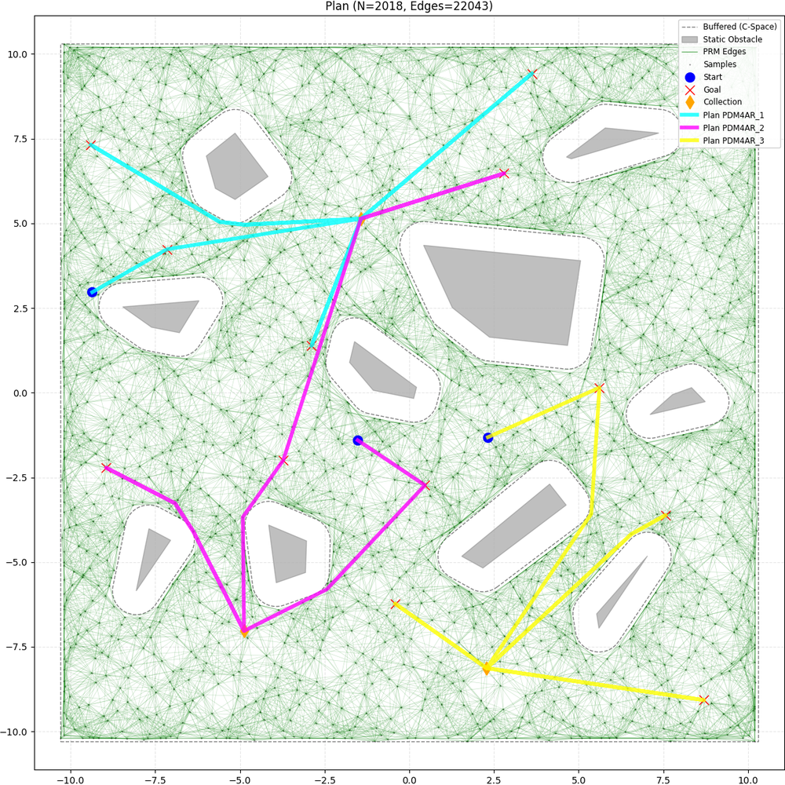
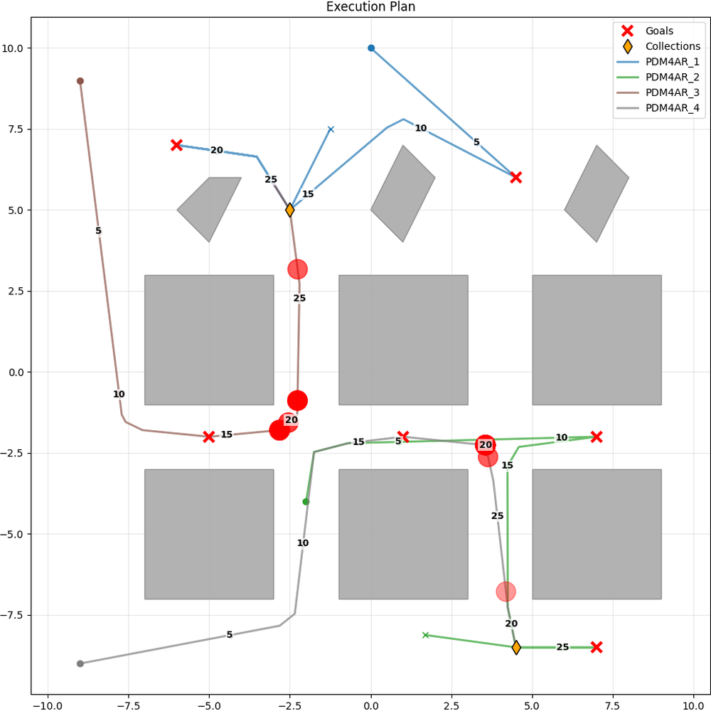
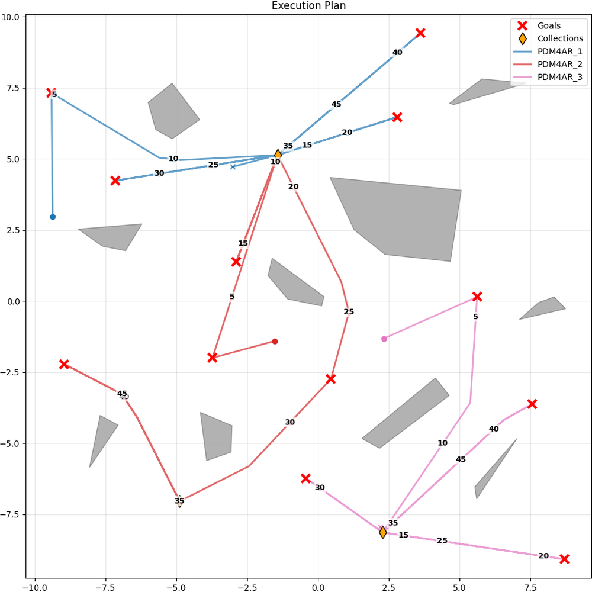
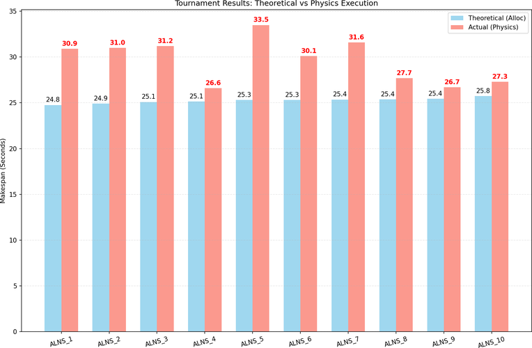
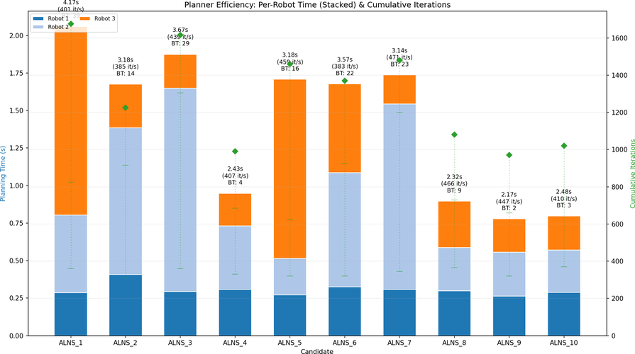

# Multi-Agent-Warehouse-Robotics

*🏆 **Ranked 1st out of 120 student groups** on the private test cases in the Planning and Decision Making for Autonomous Robots (PDM4AR) master's course at ETH Zurich.*

## Overview
This project tackles a complex Multi-Agent Path Finding (MAPF) and task allocation problem in a simulated warehouse environment. The system efficiently allocates tasks to multiple differential-drive robots and coordinates collision-free paths to minimize the overall makespan.

## Visuals
| Config 1 | Config 2 | Config 3 |
| :---: | :---: | :---: |
|  |  |  |

## The Problem
* **Objective:** Efficiently allocate package pickup/drop-off tasks to multiple robots and navigate them through a warehouse without collisions.
* **Challenges:** Managing deadlocks, calculating exact costs for differential-drive kinematics, and avoiding "accidental pickups" (moving through a goal meant for another task).

## Our Approach & Crucial Considerations
We broke the problem down into three highly optimized steps:

1. **PRM & Exact Kinematic Cost Matrix:** 
   We generated a Probabilistic Roadmap (PRM) and smoothed the curves. We then calculated the *exact* time-cost from every point to every other point, strictly based on the optimal speed of a differential-drive robot. The cost explicitly calculated the rotation required to transition between path segments.
   
2. **Task Allocation via Adaptive Large Neighborhood Search (ALNS) & Viterbi DP:** 
   Our core allocator was a custom ALNS metaheuristic. 
   * **Adaptive Operators:** It dynamically swapped between multiple "destroy" operators (`random`, `worst`, `spatial`, and `critical`) based on an adaptive weight system (roulette wheel selection) and the current "imbalance" of the task load.
   * **Viterbi Dynamic Programming:** For intensifying the search on small clusters of tasks, we implemented an exact Viterbi DP algorithm to brute-force the mathematically optimal sequence of drop-off points (collections), entirely avoiding local minima for those sub-segments.
   * **Regret Insertion with Noise:** Rebuilding the schedule utilized a weighted regret-insertion objective, balancing makespan vs. efficiency, injected with simulated annealing temperature noise to escape deep local optima.

3. **Space-Time Planner & Permutations:** 
   For final continuous path planning, we used a feed-forward space-time approach, leveraging the exact simulation physics. Deadlocks were handled via a backtracking mechanism.

### Key Optimizations (The "Secret Sauce")
To secure the 1st place finish, our solver relied on several highly specific geometric and kinematic optimizations that shaved crucial fractions of a second off every single task.

* **Bidirectional/Reverse Driving:** Differential drive turn costs were computed for both forward and reverse approaches (i.e., turning $\Delta\theta$ vs $\Delta\theta + \pi$). The optimizer actively chose to drive backwards if the required turn time was shorter.
* **Accidental Pickup Avoidance:** In Multi-Agent Path Finding, a robot might accidentally trigger a goal by passing through its radius while on the way to a completely different target. We explicitly pre-calculated Goal Conflicts for all edges in the PRM and dynamically blocked paths that intersected forbidden goals during the APSP (All-Pairs Shortest Path) calculation.

#### Center of Mass (COM) Edge Optimization
In standard pathfinding, waypoints are placed at the dead center of the target zones (Goals and Collections). However, the simulation considers a task "complete" the moment the robot's footprint polygon intersects the target polygon. Forcing the robot to drive all the way to the centroid is a massive waste of time.

After the macroscopic routing was complete, our `_optimize_node_pos` algorithm executed a geometric **Corner Cut (Bisector)** optimization:
1. It calculates the incoming unit vector ($\vec{u}_1$) from the Previous Node.
2. It calculates the outgoing unit vector ($\vec{u}_2$) to the Next Node.
3. It computes the normalized bisector direction $\vec{u}_{dir} = \frac{\vec{u}_1 + \vec{u}_2}{||\vec{u}_1 + \vec{u}_2||}$.
4. It shifts the waypoint away from the dead center along this bisector by the maximum safe radius $R_{safe}$ (Target Radius - Margin).

<p align="center">
  
</p>

*As shown above, the Edge Optimization literally "cuts the corner", allowing the robot to graze the very edge of the target zone before immediately turning towards its next destination. The algorithm also includes an obstacle validity check—if pushing the waypoint outward causes the path to intersect a static obstacle, it uses an asymmetric fallback strategy to slide the point safely along the incoming or outgoing edge instead.*

### Visualizing the Pipeline

To truly understand how our algorithm achieves optimal makespans, we can break down the process into three distinct visual phases: Mapping, Allocation, and Space-Time Execution across multiple warehouse configurations.

#### 1. Probabilistic Roadmap (PRM) & Smoothing
Before any routing occurs, we build an optimized PRM. By iteratively sampling, connecting, and smoothing (using visibility heuristics), we create a highly efficient continuous-space graph that avoids all static obstacles.

| Config 2 | Config 3 |
| :---: | :---: |
|  |  |

<p align="center"><i>The final smoothed PRM graphs. Notice how paths cleanly hug the edges of obstacles to minimize travel distance.</i></p>

#### 2. Task Allocation (ALNS) & The Combinatorial Explosion
The warehouse task assignment is essentially a Multi-Agent Traveling Salesman Problem (mTSP). As the number of tasks and robots increases, the number of possible routing permutations grows factorially (a combinatorial explosion), making it mathematically impossible to brute-force the optimal assignment. 

To overcome this, our **Adaptive Large Neighborhood Search (ALNS)** metaheuristic intelligently navigates this massive search space. By dynamically destroying and repairing schedules, it rapidly converges on near-optimal configurations.

<p align="center">
  
</p>
<p align="center"><i>A live trace of our ALNS solver minimizing the makespan over a 10-second run. Note how the algorithm plummets through the search space, finding a highly optimal solution in under 2 seconds, effectively neutralizing the combinatorial explosion.</i></p>

Once the graph is built and exact kinematic costs are computed, the ALNS allocator groups tasks spatially to ensure robots do not cross into each other's territories unnecessarily, minimizing bottleneck traffic.

| Config 2 | Config 3 |
| :---: | :---: |
|  |  |

<p align="center"><i>A visualization of fully allocated scenarios. The ALNS solver has grouped tasks spatially, ensuring robots do not cross into each other's territories unnecessarily, minimizing bottleneck traffic.</i></p>

#### 3. Continuous Space-Time Execution & Escalating Backtracking
The most critical part of our execution is how robots handle dynamic collisions without falling into permanent deadlocks. We do not use a standard decentralized reactive approach (which leads to deadlocks) or a massive joint-state search (which is computationally impossible). 

Instead, we use an **Exact Continuous Space-Time Planner** paired with an **Escalating Temporal Backtracking** mechanism to simulate the physics forward perfectly before any commands are executed:

1. **Prioritization & Footprint Hashing:** Robots are assigned a priority sequence. As each robot plans its path, it permanently reserves its physical 2D footprint across discrete time steps inside a global reservation dictionary.
2. **Exact Kinematics:** Lower-priority robots attempt to move greedily towards their waypoints using exact differential-drive inverse kinematics ($\omega_{l}, \omega_{r}$).
3. **The Temporal Backtrack (Rewinding Time):** When a collision is imminent (a proposed footprint intersects a higher-priority robot's reserved space in the future), the robot first tries to wait in place. However, if waiting *also* results in a collision (e.g., a higher-priority robot is actively driving *into* it), the planner executes a temporal backtrack:
   * It rewinds the robot's physical simulation backwards in time, popping previous moves off its trajectory.
   * It calculates the exact amount of time it just rewound, and forces the robot to sit in a `WAIT` state *in the past* for that exact duration. This allows the higher-priority obstacle to pass before the lower-priority robot even arrives at the intersection.
4. **Escalating Pop Magnitude:** If the robot continually gets stuck in the same bottleneck, a consecutive failure counter increments. The algorithm dynamically escalates the "Pop Magnitude"—rewinding time in increasingly larger chunks (1 move, then 2, 5, 10, up to 15 moves into the past) to escape deep local minima and clear massive traffic jams.
5. **Permutation Tournament:** Finally, because prioritizing Robot A over Robot B might cause Robot B to wait too long, the algorithm runs this exact continuous physics simulation across multiple priority permutations and simply deploys the permutation that finishes with the lowest overall makespan.

<p align="center">
  <pre>
  Time  | Robot Path         | Event
  -------------------------------------------------------------
   t=4  | [Crash!]           | 💥 Hits high-priority robot
   t=3  | Move Forward       | ⏪ Backtrack triggered
   t=2  | Move Forward       | ⏪ Backtrack triggered
   t=1  | [Restored State]   | 🛑 Forced to Wait for 2 steps
   t=2  | [Wait...]          | ⏱️ High-priority robot passes
   t=3  | [Wait...]          | ⏱️ Clear
   t=4  | Move Forward       | ✅ Resumes path safely
  </pre>
</p>

To make this logic transparent, here is a simplified pseudocode representation of our Exact Space-Time solver:
```python
def plan_physics(robot, targets, global_reservations):
    trajectory = []
    consecutive_fails = 0
    
    while not reached_all(targets):
        cmd = get_exact_inverse_kinematics(robot.state, targets[0])
        next_footprint = simulate_forward(robot.state, cmd, dt)
        
        if is_safe(next_footprint, global_reservations, current_time + dt):
            # SAFE: Execute move
            robot.state = next_footprint
            trajectory.append(cmd)
            consecutive_fails = 0
            
        else:
            # COLLISION: Try waiting in place
            wait_footprint = simulate_forward(robot.state, WAIT_CMD, dt)
            if is_safe(wait_footprint, global_reservations, current_time + dt):
                trajectory.append(WAIT_CMD)
            else:
                # DEADLOCK: Escalating Temporal Backtrack
                consecutive_fails += 1
                moves_to_pop = calculate_escalation(consecutive_fails) # 1, 2, 5, 10...
                
                # Rewind Time
                for _ in range(moves_to_pop):
                    trajectory.pop() 
                
                # Force robot to wait in the past
                robot.state = trajectory[-1].state
                force_wait(moves_to_pop_duration)
```

| Config 2 | Config 3 |
| :---: | :---: |
|  |  |

<p align="center"><i>The Space-Time execution trace. The red circles indicate locations where a robot intelligently chose to "Wait" for a higher-priority robot to pass. If a collision is unavoidable, the robot utilizes Escalating Backtracking to rewind time and wait earlier in its path.</i></p>

#### 4. The "Physics Tournament" (Theoretical vs. Actual)
Because ALNS allocates tasks based on a theoretical cost matrix (assuming no dynamic robot-to-robot collisions), the "best" ALNS solution might actually suffer from heavy traffic jams during execution. 

To guarantee the absolute fastest delivery time within the 60-second global planning window, we implemented a **Physics Tournament**:
* We take the Top 10 unique task allocations generated by the ALNS solver.
* We run all of them through the Exact Space-Time Planner.
* We deploy the solution that produces the lowest **Actual Makespan** after physical collision resolution.

| Makespan Comparison | Planner Efficiency |
| :---: | :---: |
|  |  |

<p align="center"><i><b>Left:</b> The Physics Tournament in action. While ALNS_1 had the best theoretical cost, ALNS_4 proved to be the fastest in actual physics execution (26.6s) because its specific spatial distribution resulted in fewer traffic jams. <br><b>Right:</b> Computational efficiency of the Space-Time Planner. Higher-priority robots (dark blue) plan almost instantly, while lower-priority robots (light blue/orange) require more iterations and backtracking to navigate by the others.</i></p>

## Setup and Execution
Due to the complex academic dependencies required for the physics engine and planners (e.g., `dg-commons`, `cvxpy`, and `casadi`), this project is configured to run flawlessly inside a **VS Code Devcontainer**. This isolates the environment and guarantees it runs regardless of your host operating system.

### Recommended Installation (Docker + VS Code)
1. Ensure you have **Docker Desktop** running and **Visual Studio Code** installed with the "Dev Containers" extension.
2. Clone this repository and open it in VS Code.
3. VS Code will detect the `.devcontainer` folder and prompt you to **"Reopen in Container"**. Click it. (If it doesn't prompt, press `Ctrl+Shift+P` and type `Dev Containers: Reopen in Container`).
4. Docker will automatically pull the base image, install all the Poetry dependencies, and configure the Python environment.

### Running the Code
Once inside the Devcontainer, you have two simple ways to execute the simulation:

**Option 1: Using the VS Code Debugger (Recommended)**
* Open the "Run and Debug" panel in VS Code (`Ctrl+Shift+D`).
* Select the pre-configured **"Exercise14 - Run"** or **"Exercise14 - Debug"** profile and hit play.

**Option 2: Using the Terminal**
Run the built-in PDM4AR course CLI script directly:
```bash
poetry run pdm4ar-exercise --exercise 14
```

## Acknowledgements
This codebase was developed as the final project for the **Planning and Decision Making for Autonomous Robots (PDM4AR)** master's course at **ETH Zurich** (Fall 2025). The simulation environment, physics engine, and base exercise framework were provided by the [IDSC Frazzoli Lab](https://github.com/PDM4AR). You can find the original exercise description and constraints [here](https://pdm4ar.github.io/exercises/14-multiagent_collection.html).
